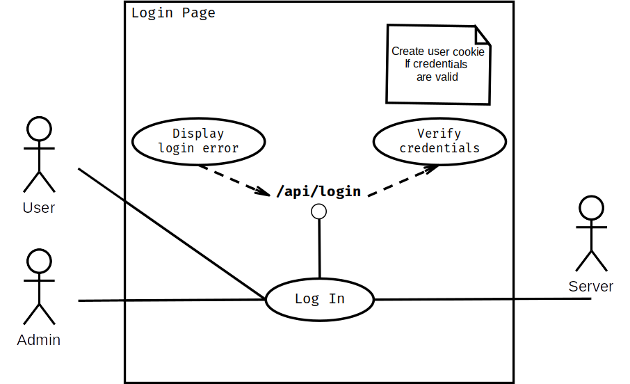
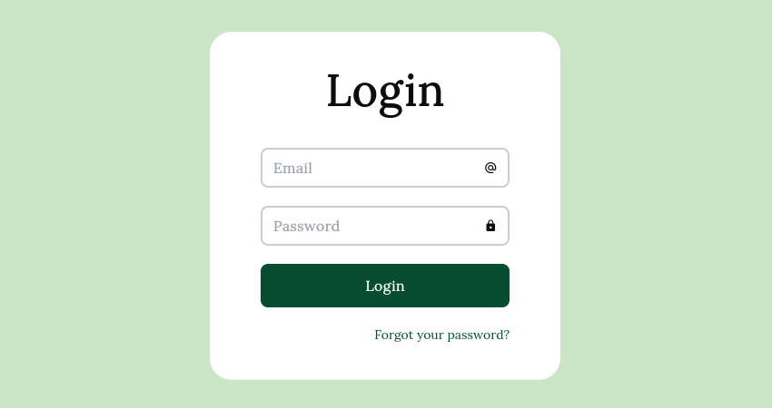
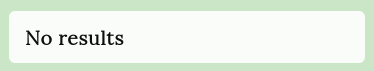
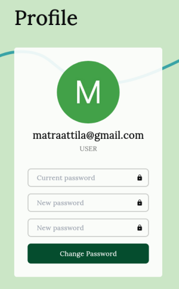
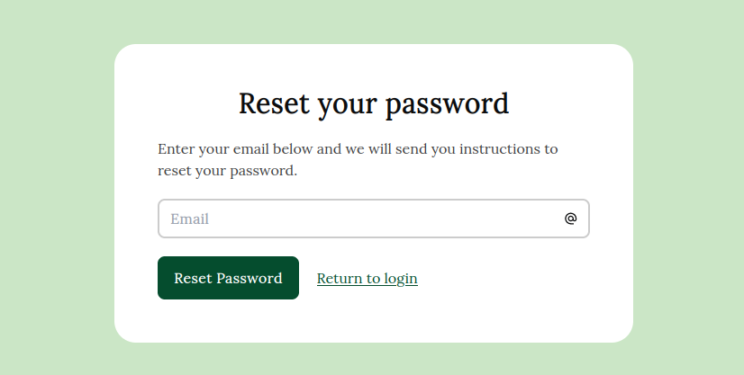
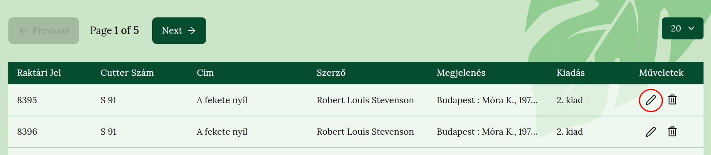

## Bevezető

### Dolgozatom témája és célja
Dolgozatom témájának egy webes alapú könyvtár kezelő alkalmazást választottam. Az alkalmazás ötlete egy beszélgetés során jött napvilágra, az iskola könyvtárosával, amiben felvetődött, hogy a könyvtári szoftver amit használ lassan 15 éves, ezért gondoltam szívesen vállalkoznék egy ilyesmi program megírására.

A programom célja az iskolai könyvtáros munkájának megkönnyítése. Mégpedig azzal, hogy megtudja tekinteni a raktáron lévő könyvek adatait egy könnyen átlátható táblázat formájában, ami rendezhető is az egyes oszlopok alapján (*cím*, *raktári jel*, stb.). Mindezek mellett lehetősége van keresni a könyvek adatai közt (*cím* és *szerző* alapján), módosítani egy könyv adatait vagy eltávolítani azt. 

### Program követelmények

- Felhasználó alapú rendszer kétféle jogosultsággal (*admin*, *user*)
- Munkafolyamat kezelése `Cookie`-val
- Jelszó változtatás/visszaállítás lehetősége
- Könyvek adatainak
  - feltöltése egy `tsv` kiterjesztésű fájlból és a feltöltött könyvek számának vizuális megjelenítése
  - keresése *cím* és *szerző* alapján
  - megjelenítése egy táblázatban (szerkeszthető cellákkal)

## Fejlesztői dokumentáció

### Fejlesztői környezet és a felhasznált technológiák

**Környezet**:

- Platform: 
  - `Ubuntu 22.04 LTS x86_64 Linux operációs rendszer` 
  - `Intel(R) Core(TM) i5-8300H CPU @ 2.30GHz`
  - `8GiB RAM`
  - `GeForce GTX 1050 Ti Mobile videókártya`
  
- Kódszerkesztő: `Visual Studio Code 1.76.2`
- Böngésző: `Firefox 111.0.1 (64-bit)` és `Chromium 111.0.5563.110`
- JavaScript futási környezet: `node 18.14.0 lts/hydrogen`

**Főbb technológiák:**

- Program kód:  A program a `NextJS` JavaScript keretrendszerben íródott (`v13.1.6` az `app` könyvtár használatával [jelenleg *béta* funkció]), amely *Full stack* tehát lefedi mind a *felhasználói felületet (frontend)* és mind a *szerver oldalt (backend)*.
- Programozási nyelv: `TypeScript 4.7.4`
- CSS keretrendszer: `TailwindCSS 3.2.4`
- Adatbázis: `MongoDB 6.0.4`

**Egyéb technológiák:**

- `daisyUI 2.46.1` - Egy ingyenes TailwindCSS plugin  (komponens könyvtár)
- `ApexCharts 3.37.0` - Diagram könyvtár
- `TanStack Table 8.7.8` - Erőteljes TS/JS, React és sok más JavaScript könyvtár/keretrendszer számára
- `DiceBear 5.3.0` - Avatár generáló könyvtár
- `Mongoose 6.8.2` - ODM (Objektum Adat Modellező) könyvtár a MongoDB-hez
- `bcrypt 5.1.0` - Hash generáló és ellenőrző könyvtár
- `Axios 0.27.2` -  Ígéret alapú (promise based) HTTP kliens
- `SWR 1.3.0` - React hook-ok adatlekéréshez (a [*HTTP RFC 5861*](https://tools.ietf.org/html/rfc5861) dokumentumban megfogalmazottakat is alkalmazva)

### Adatbázis

Egy modell a következő képpen hozható létre:

A `mongoose` csomag `Schema` osztályával létre tudunk hozni egy *sémát*. Amikor a `mongoose.model` metódust meghívjuk egy sémán, az összeállít egy *modell*-t. Egy modell példányát *dokumentum*-nak nevezzük, ezzel végezhetünk adatbázis műveletek egy adott kollekció-n. A létrejött kollekció neve mindig a model nevének *kisbetűs*, *többesszámú* változata lesz (pl.: User -> users). (Amennyiben a kollekció már létezik, nem íródik felül)

**Példa:**

```typescript
// Séma létrehozása, modell összeállítása:
import mongoose, { Schema } from 'mongoose'

const ResetTokenSchema = new Schema({
  email: String,
  token: String,
  expiration: Date,
})

// Amennyiben már létezik a ResetToken modell, a program azt fogja
// használni. Ellenkező esetben a ResetTokenSchema alapján létrehoz  
// egy új ResetToken nevű modellt.
export default mongoose.models.ResetToken || 
  mongoose.model('ResetToken', ResetTokenSchema)
```

```typescript
// Modell használata:
import ResetToken from '@/models/ResetToken'

// Az ResetToken modell példányosításakor létrejön egy új 'dokumentum'
const newResetToken = new ResetToken({
  // ...
})

// Az új dokumentumot elmentjük az adatbázisba
await newResetToken.save()
```

#### Modellek

`Book`

```typescript
const BookSchema = new Schema(
  {
    raktariJel: { type: Number, unique: true },
    cutterSzam: String,
    cim: { type: String, required: true },
    szerzoiAdatok: {
      szerzo: String,
      adatok: String,
    },
    kiadas: String,
    megjelenes: String,
    fizikaiJellemzok: String,
    sorozat: String,
    megjegyzesek: String,
    kategoria: String,
  },
  { timestamps: true }
)
```

`ResetToken`

```typescript
const ResetTokenSchema: Schema = new Schema({
  email: String,
  token: String,
  expiration: Date,
})	
```

`Statistic`

```typescript
const StatisticSchema = new Schema({
  bookCount: Number,
  uploads: [
    {
      value: Number,
      date: Date,
    },
  ],
})
```

`User`

```typescript
const UserSchema = new Schema({
  email: String,
  password: String,
  role: String,
})
```

### Jogosultsági szintek

**User**

Általános felhasználói szint. A következőkre jogosult:

- Jelszó visszaállítás kérése
- Jelszó változtatása
- Könyvek keresése

**Admin** 

A könyvtáros számára fenntartott szint. A felhasználói szinten túl, jogosult a könyvek

- feltöltésére

- szerkesztésére

- törlésére

### Telepítési útmutató

A program telepítéséhez és futtatásához a node.js[^1] `v18.14.0` és a hozzá tartozó npm  `v9.3.1` szükséges.

Hajtsa végre a következő utasításokat a program gyökér könyvtárába. (Ahol a program `package.json` fájlja helyezkedik el)

```shell
# A program csomagok telepítése
npm install

# A program megépítése
npm run build

# A program futtatása
npm start
```

A program a http://localhost:3000 URL címen érhető el.

[^1]: https://nodejs.org/en


### Tesztelési dokumentáció

#### Regisztráció (`/api/register`)

Új felhasználó hozzáadására a `POST /api/register` API végponton van lehetőség.

A kérés formátuma:

```json
{
  "email": "test@test.com",
  "password": "123456",
  "role": "user"
}
```


A végpont hiba üzenettel tér vissza az alábbi esetekben:

1. Hiányzó mező(k)

*Kérés*: 

```json
{
  "email": "test@test.com",
}
```

*Válasz:*

```json
{
  "message": "Required fields are email, password and role!"
}
```

2. A *role* mező értéke helytelen

*Kérés*: 

```json
{
  "email": "test@test.com",
  "password": "123456",
  "role": "administrator"
}
```

*Válasz:*

```json
{
  "message": "Accepted roles are the following: user, admin!"
}
```

**Forrás kód**

Minden API végpontnak a `pages/api` mappán belül kell elhelyezkednie és egy alapértelmezetten exportált függvénnyel kell rendelkeznie. Ez a függvény fogja kezelni a bejővő HTTP kéréseket, ezért szokás 'request handler'-nek (kérelem kezelő) vagy röviden `handler`-nek nevezni.

A kérelem objektum-ból (`req`) destruktorált `method` változó a HTTP kérés metódusát (GET, POST, stb.) tárolja.

```typescript
export default async function handler(req: NextApiRequest, res: NextApiResponse) {
  const { method } = req
}
```

A `method` változó értéke 

```typescript
// ...
switch (method) {
  case 'POST': {
  }
  case: 'GET': {
  }
}
// ...
```


#### Bejelentkező felület (`/login`)

A felhasználók email cím és jelszó megadásával jelentkezhetnek be a rendszerbe.





| Történés | Üzenet |
| -------- | ------ |
|Sikeres bejelentkezés||
|A megadott felhasználónév vagy jelszó helytelen||


#### Könyvek feltöltése (`components/UploadBooks`)


| Történés | Üzenet |
| -------- | ------ |
|Sikeres felvitel||
|A kiválasztott fájl formátuma nem megengedett||
|A fájlban nem található egyetlen új könyv sem||


#### Könyvek keresése (`/books`)


| Történés | Üzenet |
| ---- | ---- |
|      Nincs keresési találat| |
| Keresés közben meghiúsult az adatbázis kapcsolat|            |


#### Könyvek szerkesztése (`/books`)


| Történés                                | Üzenet                                                       |
| --------------------------------------- | ------------------------------------------------------------ |
| A változtatások mentésre kerültek       |  |
| A könyv törlése sikeres                 |   |
| A szerkesztett könyv mentése meghiúsult |  |
| A könyv törlése meghiúsult              |  |


#### Profil kép (`components/Avatar`)

Attól függően kap értéket a profil kép, hogy a tárhelyen létezik-e a felhasználó azonosítójával megegyező kép (pl.: *63dd594e7f98fc7ec3a1fa76.png*).


#### Jelszó változtatása (`/profile`)




| Történés                               | Üzenet                                                       |
| :------------------------------------- | :----------------------------------------------------------- |
| A jelszó meg lett változtatva          |  |
| A program kilépteti a felhasználót     |  |
| A jelszavak nem egyeznek               |         |
| A jelenlegi jelszó helytelen           |   |
| Az új jelszó megegyezik a jelenlegivel |  |

#### Jelszó visszaállítása (`/passwordReset`)



| Történés                                                     | Üzenet                                                       |
| ------------------------------------------------------------ | ------------------------------------------------------------ |
| A jelszó visszaállító email sikeresen kézbesítve lett        |  |
| A jelszó visszaállítást igénylő email cím nincs regisztrálva |  |
| A jelszó visszaállítást igényelő felhasználó (aki még nem használta fel a jelszó visszaállító link-jét), ismételten kérelmezi jelszava visszaállítását: |  |

#### Jelszó létrehozása (`/createPassword`)


| Történés      |  Üzenet    |
| ---- | ---- |
|      Az új jelszó létrejött |  |
| A jelszavak nem egyeznek |  |
|Az email címhez tartozó jelszó visszaállító link már fel lett használva |       |
|A jelszó visszaállító link-ben szereplő token valamilyen oknál fogva megsérült vagy valóban nem megfelelő|      |
|A jelszó visszaállító link lejárt|      |

## Felhasználói dokumentáció

A dokumentáció használata során az egyes alcímekben fellelhető lesz az *Admin* kifejezés. Ezek olyan programrészek leírását tartalmazzák amelyeket csak az Admin jogosultsággal rendelkező felhasználók érnek el.

### Rendszerkövetelmények

#### Minimális rendszerkövetelmények
- 64-bites processzor és Operációs rendszer
- Processzor: Intel Core i3 2.5 Ghz vagy AMD Phenom II 2.6 Ghz 
- Operációs rendszer: Windows 8.1 vagy *NIX
- Memória: 4GB RAM
- Monitor: 1280×720-as vagy nagyobb felbontás
- Grafikus kártya: 1 GB és AMD 5570 vagy Intel Integrated Graphics 530
- Tárhely: 20GB
- 2MB/s sebességű Internet elérés

#### Ajánlott rendszerkövetelmények
- 64-bites processzor és Operációs rendszer
- Processzor: Intel Core i5 2.5 Ghz vagy AMD FX8350 4.0 Ghz 
- Operációs rendszer: Windows 10/11 vagy *NIX (2018 utáni kiadás)
- Memória: 8GB RAM
- Monitor: 1920x1080-as vagy nagyobb felbontás
- Grafikus kártya: 2GB és AMD 7970 vagy nVidia 770
- Tárhely: 120GB
- 100MB/s sebességű Internet elérés

**Támogatott böngészők:**

- Chrome (64+)
- Edge (79+)
- Firefox (67+)
- Opera (51+)
- Safari (12+)

### A program megnyitása

1. lépés: Nyissa meg a *Rendszerkövetelmények* részben említett böngészők egyikét.

2. lépés: Kattintson a böngésző *címsorába*.

Firefox böngésző címsora:


 Chromium böngésző címsora:


3. lépés: Írja be a következő URL címet: http://localhost:3000 és nyomjon `Enter` billentyűt.

### A program használata

A program 3 "oldalból" áll: 

- Főoldal
- Könyvek
- Profil

A Menüsávon belüli menüpontok használatával tud az oldalak között váltani. (Az utolsó menüpont a programból való Kijelentkezés)

 Egy menüpont fehér háttere jelzi, hogy jelenleg azon az oldalon tartózkodik.


#### Bejelentkezés

1. Írja be email címét
2. Írja be jelszavát
3. Kattintson a Bejelentkezés gombra


#### Könyvek feltöltése [Admin]

Kattintson a *Főoldal* menüpontra.

1. Kattintson a *Töltsön fel egy tsv fájlt* alcím alatti *Böngészés...* mezőre. (Az eszközén található fájlkezelő fog megjelenni egy felugró ablakban)


2. A fájlkezelőn belül navigáljon a feltöltendő fájlt[^1] tartalmazó mappába és kattintson rá duplán


3. Kattintson a *Feltöltés* gombra


[^1]: A könyvek adatait tartalmazó `.tsv` kiterjesztésű dokumentum

#### Könyvek böngészése

A könyvek adatai egy lapozható táblázatban vannak megjelenítve. 

1. Az oldalszám mutató mellett elhelyezkedő gombokkal tud lapozni

2. A lenyíló listából választható ki a megjelenítendő könyvek száma oldalanként

3. A táblázat oszlopainak fejlécére való kattintással tudja rendezni a táblázat elemeit. 

   Az ábrán a fejlécre kattintás esete látható, a táblázat a *Raktári jel* alapján került csökkenő sorrendbe (Ismételt kattintás után növekvő sorrendbe kerül).


#### Könyvek keresése

Kattintson a *Könyvek* menüpontra.

1. Kattintson a *Könyvek* főcím alatti kereső mezőbe


2. Írja be a keresni kívánt könyv *címét* vagy *íróját* és nyomja meg az `Enter` billentyűt

#### Könyvek szerkesztése és törlése [Admin]

##### Szerkesztés

1. Kattintson a szerkesztés ikonra



2. Végezze el a kívánt módosításokat a beviteli mezőkben és kattintson a *Mentés* gombra


##### Törlés

1. Kattintson a törlés ikonra


2. Kattintson az *Igen* gombra a könyv törlésének jóváhagyásához

   


#### Jelszó megváltoztatása

Kattintson a *Profil* menüpontra.

1. Írja be jelenlegi jelszavát
2. Írja be új jelszavát
3. Ismételje meg új jelszavát
4. Kattintson a *Jelszó megváltoztatása* gombra


#### Elfelejtett jelszó visszaállítása

*Amennyiben be van jelentkezve egy másik fiókjával, kérem jelentkezzen ki.*

1. A *Bejelentkezési* oldalon kattintson az *Elfelejtette jelszavát?* link-re. 

   

   

2. Adja meg az elfelejtett jelszavához tartozó fiók email címét és kattintson a "Jelszó visszaállítása" gombra


3. Nyissa meg levelező programját, keresse meg a jelszó visszaállítással kapcsolatos email-t és kattintson rá.


4. Kattintson az email-ben található *Jelszó visszaállítása* gombra


5. A megnyílt oldalon adja meg új jelszavát és kattintson a *Létrehozás* gombra


Sikeresen visszaállította jelszavát! Nincs más dolga mint hogy bejelentkezzen új jelszavával.
