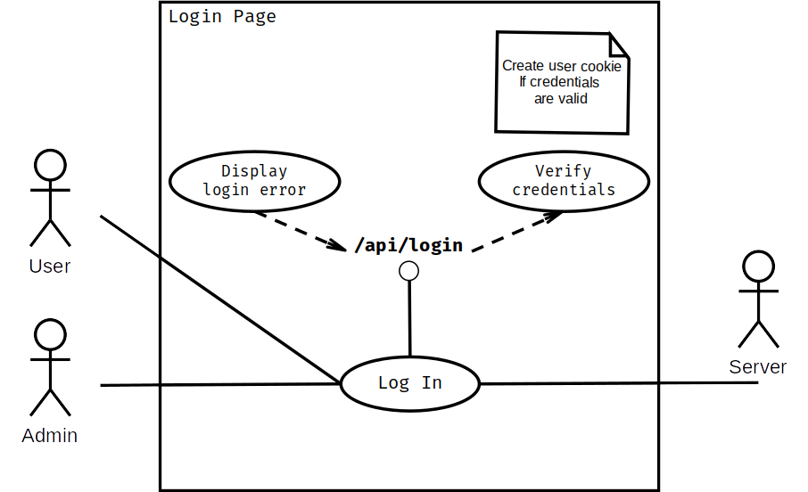
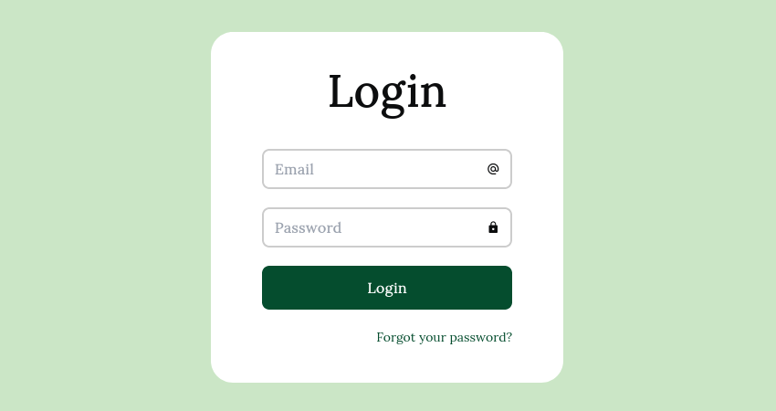
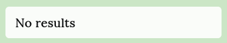
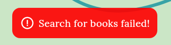
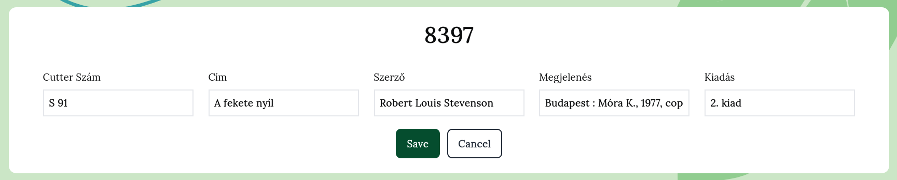
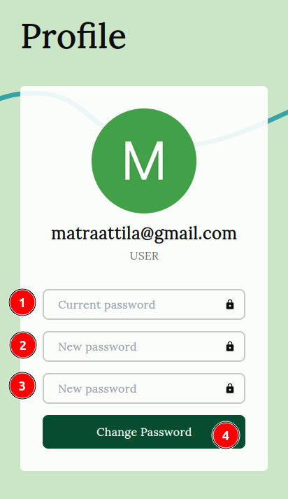
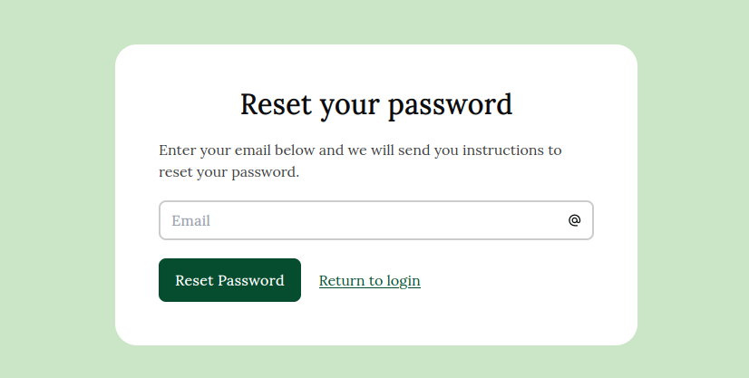
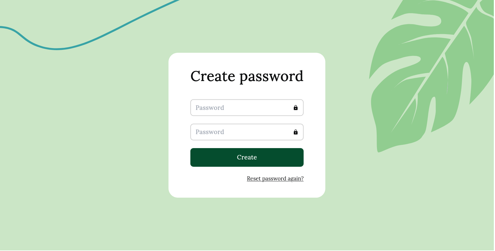

## Fejlesztői dokumentáció

### Fejlesztői környezet és a felhasznált technológiák

**Környezet**:

- Platform: 
  - `Ubuntu 22.04 LTS x86_64 Linux operációs rendszer` 
  - `Intel(R) Core(TM) i5-8300H CPU @ 2.30GHz`
  - `8GiB RAM`
  - `GeForce GTX 1050 Ti Mobile videókártya`
  
- Kódszerkesztő: `Visual Studio Code 1.76.2`
- Böngésző: `Firefox 111.0.1 (64-bit)` és `Chromium 111.0.5563.110`
- JavaScript futási környezet: `node 18.14.0 lts/hydrogen`

**Főbb technológiák:**

- Program kód:  A program a `NextJS` JavaScript keretrendszerben íródott (`v13.1.6` az `app` könyvtár használatával [jelenleg *béta* funkció]), amely *Full stack* tehát lefedi mind a *felhasználói felületet (frontend)* és mind a *szerver oldalt (backend)*.
- Programozási nyelv: `TypeScript 4.7.4`
- CSS keretrendszer: `TailwindCSS 3.2.4`
- Adatbázis: `MongoDB 6.0.4`

**Egyéb technológiák:**

- `daisyUI 2.46.1` - Egy ingyenes TailwindCSS plugin  (komponens könyvtár)
- `ApexCharts 3.37.0` - Diagram könyvtár
- `TanStack Table 8.7.8` - Erőteljes TS/JS, React és sok más JavaScript könyvtár/keretrendszer számára
- `DiceBear 5.3.0` - Avatár generáló könyvtár
- `Mongoose 6.8.2` - ODM (Objektum Adat Modellező) könyvtár a MongoDB-hez
- `bcrypt 5.1.0` - Hash generáló és ellenőrző könyvtár
- `Axios 0.27.2` -  Ígéret alapú (promise based) HTTP kliens
- `SWR 1.3.0` - React hook-ok adatlekéréshez (a [*HTTP RFC 5861*](https://tools.ietf.org/html/rfc5861) dokumentumban megfogalmazottakat is alkalmazva)

### Adatbázis

Egy modell a következő képpen hozható létre:

A `mongoose` csomag `Schema` osztályával létre tudunk hozni egy *sémát*. Amikor a `mongoose.model` metódust meghívjuk egy sémán, az összeállít egy *modell*-t. Egy modell példányát *dokumentum*-nak nevezzük, ezzel végezhetünk adatbázis műveletek egy adott kollekció-n. A létrejött kollekció neve mindig a model nevének *kisbetűs*, *többesszámú* változata lesz (pl.: User -> users). (Amennyiben a kollekció már létezik, nem íródik felül)

**Példa:**

```typescript
// Séma létrehozása, modell összeállítása:
import mongoose, { Schema } from 'mongoose'

const ResetTokenSchema = new Schema({
  email: String,
  token: String,
  expiration: Date,
})

// Amennyiben már létezik a ResetToken modell, a program azt fogja
// használni. Ellenkező esetben a ResetTokenSchema alapján létrehoz  
// egy új ResetToken nevű modellt.
export default mongoose.models.ResetToken || 
  mongoose.model('ResetToken', ResetTokenSchema)
```

```typescript
// Modell használata:
import ResetToken from '@/models/ResetToken'

// Az ResetToken modell példányosításakor létrejön egy új 'dokumentum'
const newResetToken = new ResetToken({
  // ...
})

// Az új dokumentumot elmentjük az adatbázisba
await newResetToken.save()
```

#### Modellek

`Book`

```typescript
const BookSchema = new Schema(
  {
    raktariJel: { type: Number, unique: true },
    cutterSzam: String,
    cim: { type: String, required: true },
    szerzoiAdatok: {
      szerzo: String,
      adatok: String,
    },
    kiadas: String,
    megjelenes: String,
    fizikaiJellemzok: String,
    sorozat: String,
    megjegyzesek: String,
    kategoria: String,
  },
  { timestamps: true }
)
```

`ResetToken`

```typescript
const ResetTokenSchema: Schema = new Schema({
  email: String,
  token: String,
  expiration: Date,
})	
```

`Statistic`

```typescript
const StatisticSchema = new Schema({
  bookCount: Number,
  uploads: [
    {
      value: Number,
      date: Date,
    },
  ],
})
```

`User`

```typescript
const UserSchema = new Schema({
  email: String,
  password: String,
  role: String,
})
```

### Jogosultsági szintek

**User**

Általános felhasználói szint. A következőkre jogosult:

- Jelszó visszaállítás kérése
- Jelszó változtatása
- Könyvek keresése

**Admin** 

A könyvtáros számára fenntartott szint. A felhasználói szinten túl, jogosult a könyvek

- feltöltésére

- szerkesztésére

- törlésére

### Telepítési útmutató

A program telepítéséhez és futtatásához a node.js[^1] `v18.14.0` és a hozzá tartozó npm  `v9.3.1` szükséges.

A következő utasításokat a program gyökérkönyvtárába hajtsa végre.

#### Környezeti változók beállítása

Az adatbázis eléréséhez a csatlakozási URI és az adatbázis neve

```
MONGODB_URI=mongodb://localhost:27017
MONGODB_DB=baross-library
```

A jelszó visszaállítási folyamathoz használt email cím és a hozzá tartozó alkalmazásjelszó ([Bejelentkezés alkalmazásjelszavakkal](https://support.google.com/accounts/answer/185833?hl=hu))

```
GMAIL_USER=test@test.com
GMAIL_PASSWORD=abcdefghijklmnop
```

A felhasználókezeléshez használt Cookie lejárati ideje (másodpercben megadva). 

Valamint a node környezet értéke "production"-re állítva, hiszen a program ezen túl "éles" környezetben fog futni (nem fejlesztőiben [development])

```
COOKIE_MAX_AGE=3600
NODE_ENV=production
```

#### A program telepítése és futtatása

```shell
# A program csomagok telepítése
npm install

# A program megépítése
npm run build

# A program futtatása
npm start
```

A program a http://localhost:3000 URL címen érhető el.

[^1]: https://nodejs.org/en


### Tesztelési dokumentáció

#### Regisztráció (`/api/register`)

Új felhasználó hozzáadására a `POST /api/register` API végponton van lehetőség.

A kérés formátuma:

```json
{
  "email": "test@test.com",
  "password": "123456",
  "role": "user"
}
```


A végpont hiba üzenettel tér vissza az alábbi esetekben:

1. Hiányzó mező(k)

*Kérés*: 

```json
{
  "email": "test@test.com",
}
```

*Válasz:*

```json
{
  "message": "Required fields are email, password and role!"
}
```

2. A *role* mező értéke helytelen

*Kérés*: 

```json
{
  "email": "test@test.com",
  "password": "123456",
  "role": "administrator"
}
```

*Válasz:*

```json
{
  "message": "Accepted roles are the following: user, admin!"
}
```

**API forrás kód**

Minden API végpontnak a `pages/api` mappán belül kell elhelyezkednie és egy alapértelmezetten exportált függvénnyel kell rendelkeznie. Ez a függvény fogja kezelni a bejővő HTTP kéréseket, ezért szokás 'request handler'-nek (kérelem kezelő) vagy röviden `handler`-nek nevezni.

A kérelem objektum-ból (`req`) destruktorált `method` változó a HTTP kérés metódusát (GET, POST, stb.) tárolja.

```typescript
export default async function handler(req: NextApiRequest, res: NextApiResponse) {
  const { method } = req
}
```

A végpont a `method` változó értéke alapján fog dolgozni

```typescript
switch (method) {
  case 'POST': {
  }
  case: 'GET': {
  }
}
```

Előfordulhat, hogy a végpont nem rendelkezik a kérés metódusával megegyező esettel. Ekkor a "Kérés típusa nem támogatott" válasszal tér vissza a végpont.

```typescript
switch (method) {
  case 'POST': {
  }
  case: 'GET': {
  } 
  default:
    res.status(405).json({ message: 'Request type is not supported' })
}
```

**Hiba kezelés**

Az eset kezelésen belül fontos a hiba tűrés/visszajelzés. Ez könnyen megvalósíható egy try/catch blokkal.

Amikor kivétel keletkezik, a catch blokkon belül hiba üzenettel tér vissza a végpont, a `res` objektum `json()` metódusának meghívásával. Ezt azonban érdemes megelőzni a `status()` metódus meghívásával, megadva paraméterként a hiba státusz kódját (500 - Server Error, 400 - Bad Request), így a kliens oldalon könnyebb lesz beazonosítani a hiba forrását.

```typescript
try {
} catch (error) {
  res
    .status(error.statusCode || 500)
    .json({ message: error.message || 'Registration failed!' })
}
```

Van, hogy egyéni hiba létrehozását igényli a program. Ilyen esetben a `throw` kulcsszóval lehet hibát "dob"-ni és az `ApiError` osztályának példányosításával lehet saját hibát létrehozni, megadva státusz kódját és üzenetét.

```typescript
if (!email || !password || !role) {
  throw new ApiError(400, 'Required fields are email, password and role!')
}
```

#### Bejelentkező felület (`/login`)

A felhasználók email cím és jelszó megadásával jelentkezhetnek be a rendszerbe.





| Történés | Üzenet |
| -------- | ------ |
|Sikeres bejelentkezés||
|A megadott felhasználónév vagy jelszó helytelen||


#### Könyvek feltöltése (`components/UploadBooks`)


| Történés | Üzenet |
| -------- | ------ |
|Sikeres felvitel||
|A kiválasztott fájl formátuma nem megengedett||
|A fájlban nem található egyetlen új könyv sem||


#### Könyvek keresése (`/books`)


| Történés | Üzenet |
| ---- | ---- |
|      Nincs keresési találat| |
| Keresés közben meghiúsult az adatbázis kapcsolat|            |


#### Könyvek szerkesztése (`/books`)




| Történés                                | Üzenet                                                       |
| --------------------------------------- | ------------------------------------------------------------ |
| A változtatások mentésre kerültek       |  |
| A könyv törlése sikeres                 |   |
| A szerkesztett könyv mentése meghiúsult |  |
| A könyv törlése meghiúsult              |  |


#### Profil kép (`components/Avatar`)

Attól függően kap értéket a profil kép, hogy a tárhelyen létezik-e a felhasználó azonosítójával megegyező kép (pl.: *63dd594e7f98fc7ec3a1fa76.png*).


#### Jelszó változtatása (`/profile`)




| Történés                               | Üzenet                                                       |
| :------------------------------------- | :----------------------------------------------------------- |
| A jelszó meg lett változtatva          |  |
| A program kilépteti a felhasználót     |  |
| A jelszavak nem egyeznek               |         |
| A jelenlegi jelszó helytelen           |   |
| Az új jelszó megegyezik a jelenlegivel |  |

#### Jelszó visszaállítása (`/passwordReset`)



| Történés                                                     | Üzenet                                                       |
| ------------------------------------------------------------ | ------------------------------------------------------------ |
| A jelszó visszaállító email sikeresen kézbesítve lett        |  |
| A jelszó visszaállítást igénylő email cím nincs regisztrálva |  |
| A jelszó visszaállítást igényelő felhasználó (aki még nem használta fel a jelszó visszaállító link-jét), ismételten kérelmezi jelszava visszaállítását: |  |

#### Jelszó létrehozása (`/createPassword`)



| Történés      |  Üzenet    |
| ---- | ---- |
|      Az új jelszó létrejött |  |
| A jelszavak nem egyeznek |  |
|Az email címhez tartozó jelszó visszaállító link már fel lett használva |       |
|A jelszó visszaállító link-ben szereplő token valamilyen oknál fogva megsérült vagy valóban nem megfelelő|      |
|A jelszó visszaállító link lejárt|      |
