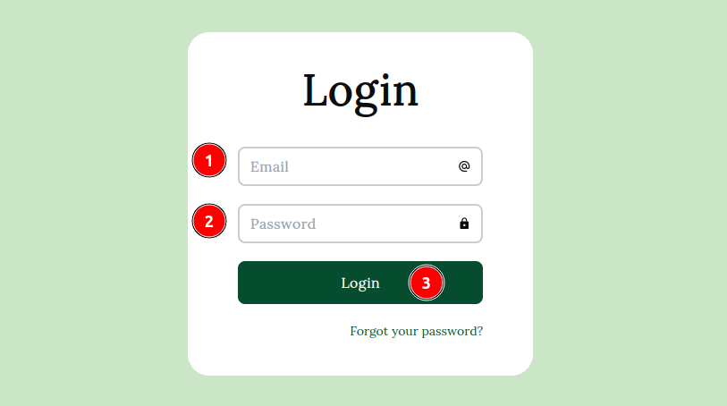
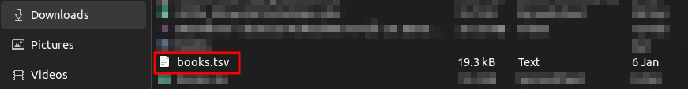
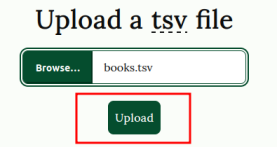
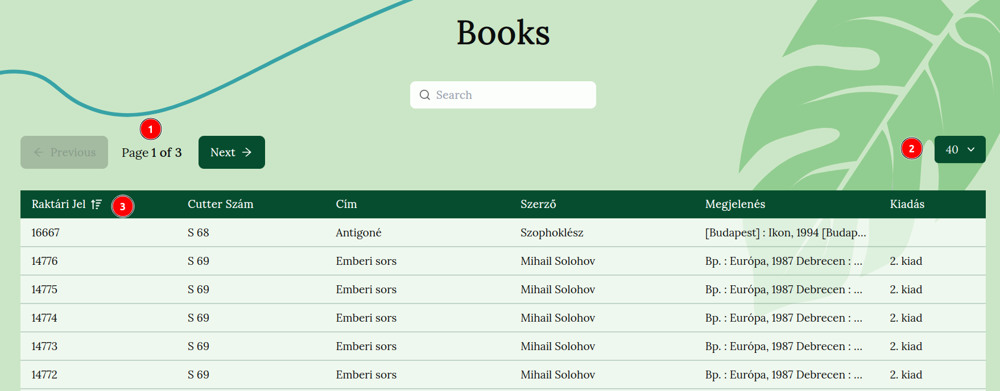
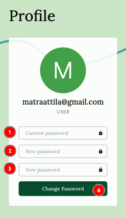
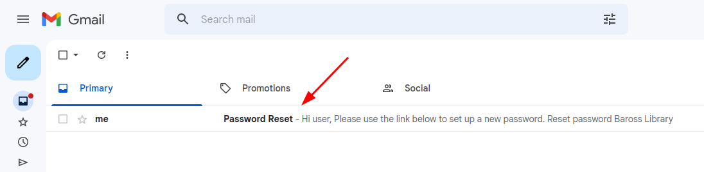
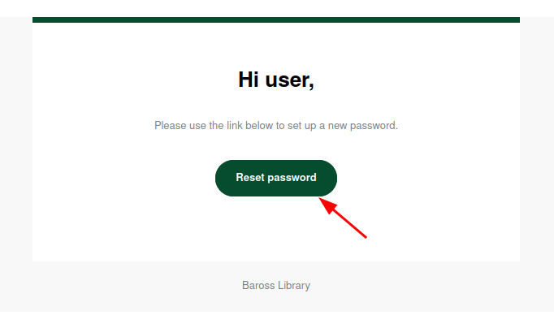

## Felhasználói dokumentáció

A dokumentáció használata során az egyes alcímekben fellelhető lesz az *Admin* kifejezés. Ezek olyan programrészek leírását tartalmazzák amelyeket csak az Admin jogosultsággal rendelkező felhasználók érnek el.

### Rendszerkövetelmények

#### Minimális rendszerkövetelmények
- 64-bites processzor és Operációs rendszer
- Processzor: Intel Core i3 2.5 Ghz vagy AMD Phenom II 2.6 Ghz 
- Operációs rendszer: Windows 8.1 vagy *NIX
- Memória: 4GB RAM
- Monitor: 1280×720-as vagy nagyobb felbontás
- Grafikus kártya: 1 GB és AMD 5570 vagy Intel Integrated Graphics 530
- Tárhely: 20GB
- 2MB/s sebességű Internet elérés

#### Ajánlott rendszerkövetelmények
- 64-bites processzor és Operációs rendszer
- Processzor: Intel Core i5 2.5 Ghz vagy AMD FX8350 4.0 Ghz 
- Operációs rendszer: Windows 10/11 vagy *NIX (2018 utáni kiadás)
- Memória: 8GB RAM
- Monitor: 1920x1080-as vagy nagyobb felbontás
- Grafikus kártya: 2GB és AMD 7970 vagy nVidia 770
- Tárhely: 120GB
- 100MB/s sebességű Internet elérés

**Támogatott böngészők:**

- Chrome (64+)
- Edge (79+)
- Firefox (67+)
- Opera (51+)
- Safari (12+)

### A program megnyitása

1. lépés: Nyissa meg a *Rendszerkövetelmények* részben említett böngészők egyikét.

2. lépés: Kattintson a böngésző *címsorába*.

Firefox böngésző címsora:

 Chromium böngésző címsora:

3. lépés: Írja be a következő URL címet: http://localhost:3000 és nyomjon `Enter` billentyűt.

### A program használata

A program 3 "oldalból" áll: 

- Főoldal
- Könyvek
- Profil

A Menüsávon belüli menüpontok használatával tud az oldalak között váltani. (Az utolsó menüpont a programból való Kijelentkezés)

 Egy menüpont fehér háttere jelzi, hogy jelenleg azon az oldalon tartózkodik.

#### Bejelentkezés

1. Írja be email címét
2. Írja be jelszavát
3. Kattintson a Bejelentkezés gombra

#### Könyvek feltöltése [Admin]

Kattintson a *Főoldal* menüpontra.

1. Kattintson a *Töltsön fel egy tsv fájlt* alcím alatti *Böngészés...* mezőre. (Az eszközén található fájlkezelő fog megjelenni egy felugró ablakban)

2. A fájlkezelőn belül navigáljon a feltöltendő fájlt[^1] tartalmazó mappába és kattintson rá duplán

3. Kattintson a *Feltöltés* gombra

[^1]: A könyvek adatait tartalmazó `.tsv` kiterjesztésű dokumentum

#### Könyvek böngészése

A könyvek adatai egy lapozható táblázatban vannak megjelenítve. 

1. Az oldalszám mutató mellett elhelyezkedő gombokkal tud lapozni

2. A lenyíló listából választható ki a megjelenítendő könyvek száma oldalanként

3. A táblázat oszlopainak fejlécére való kattintással tudja rendezni a táblázat elemeit. 

   Az ábrán a fejlécre kattintás esete látható, a táblázat a *Raktári jel* alapján került csökkenő sorrendbe (Ismételt kattintás után növekvő sorrendbe kerül).

#### Könyvek keresése

Kattintson a *Könyvek* menüpontra.

1. Kattintson a *Könyvek* főcím alatti kereső mezőbe

2. Írja be a keresni kívánt könyv *címét* vagy *íróját* és nyomja meg az `Enter` billentyűt

#### Könyvek szerkesztése és törlése [Admin]

##### Szerkesztés

1. Kattintson a szerkesztés ikonra

2. Végezze el a kívánt módosításokat a beviteli mezőkben és kattintson a *Mentés* gombra

##### Törlés

1. Kattintson a törlés ikonra

2. Kattintson az *Igen* gombra a könyv törlésének jóváhagyásához

   

#### Jelszó megváltoztatása

Kattintson a *Profil* menüpontra.

1. Írja be jelenlegi jelszavát
2. Írja be új jelszavát
3. Ismételje meg új jelszavát
4. Kattintson a *Jelszó megváltoztatása* gombra

#### Elfelejtett jelszó visszaállítása

*Amennyiben be van jelentkezve egy másik fiókjával, kérem jelentkezzen ki.*

1. A *Bejelentkezési* oldalon kattintson az *Elfelejtette jelszavát?* link-re. 

   

   

2. Adja meg az elfelejtett jelszavához tartozó fiók email címét és kattintson a "Jelszó visszaállítása" gombra

3. Nyissa meg levelező programját, keresse meg a jelszó visszaállítással kapcsolatos email-t és kattintson rá.

4. Kattintson az email-ben található *Jelszó visszaállítása* gombra

5. A megnyílt oldalon adja meg új jelszavát és kattintson a *Létrehozás* gombra

Sikeresen visszaállította jelszavát! Nincs más dolga mint hogy bejelentkezzen új jelszavával.
